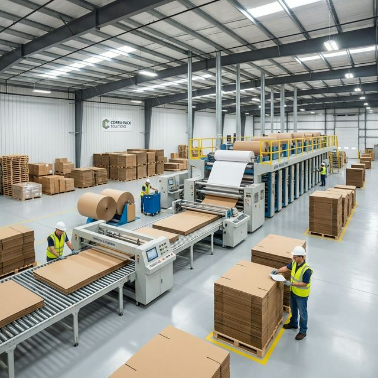

# ARTI ENTERPRISES Website

[](https://vitejs.dev/)
[](https://developer.mozilla.org/en-US/docs/Web/JavaScript)
[](https://threejs.org/)
[](https://vercel.com/)
[](#architecture)
[](#developer-tooling--automated-qa)

Production-focused website for **ARTI ENTERPRISES**, a premier corrugated box manufacturer and packaging supplier based in Chikhali, Pune. 

The project is built as a high-performance, **pure Vanilla HTML5/CSS3/JavaScript (ES Modules) static multi-page website** powered by **Vite**. It features an interactive WebGL 3D box configurator, dynamic product detail routing, dynamic educational packaging blog system, automated responsive/route test suites, and a structured WhatsApp-first lead generation funnel for B2B industrial packaging inquiries.

---

## Table of Contents

- [At a Glance](#at-a-glance)
- [Preview](#preview)
- [Three.js 3D Showcase](#threejs-3d-showcase)
- [Architecture & Rendering Model](#architecture--rendering-model)
- [Tech Stack](#tech-stack)
- [Developer Tooling & Automated QA](#developer-tooling--automated-qa)
- [Pages & Routing Structure](#pages--routing-structure)
- [Local Development](#local-development)
- [Build and Deployment](#build-and-deployment)
- [Project Structure](#project-structure)
- [Core Runtime Modules](#core-runtime-modules)
- [Customization Guide](#customization-guide)
- [SEO, Schema & Metadata](#seo-schema--metadata)
- [WhatsApp Business Package](#whatsapp-business-package)
- [License](#license)

---

## At a Glance

| Item | Details |
| :--- | :--- |
| **Business** | ARTI ENTERPRISES |
| **Industry** | Corrugated Packaging Manufacturer / B2B Industrial Packaging Supplier |
| **Location** | GAT NO 1297, Chikhali, Pune, Maharashtra 411062 |
| **Live Production URL** | [`https://arti-enterprises-delta.vercel.app`](https://arti-enterprises-delta.vercel.app) |
| **Primary Audience** | B2B purchasing managers, factories, industrial OEMs, exporters, e-commerce brands |
| **Product Lineup** | 3 Ply, 5 Ply, 7 Ply, die-cut mailers, custom printed, food-grade, and export corrugated boxes |
| **Architecture** | Modern Multi-Page Static Site (Vanilla HTML5 / CSS3 / ES Modules) bundled with Vite |
| **Interactive 3D** | Three.js WebGL hero animation + real-time 3D box dimensional configurator |
| **Lead Generation** | Centralized WhatsApp Business quotation flow with structured message formatting |
| **Testing Harness** | Automated Puppeteer suites verifying all 14 routes and 5 mobile viewports (70/70 pass) |
| **Hosting Target** | Vercel (Continuous Deployment linked to GitHub `main`) |

---

## Preview

Brand and manufacturing facility visuals:


Factory and production credibility:



Industrial corrugated packaging preview:


---

## Three.js 3D Showcase

This project uses **Three.js** to deliver interactive WebGL packaging visualization:

### 1. Homepage Interactive Hero
- Motion-driven 3D corrugated box model
- Drag-to-rotate interaction with smooth inertial damping
- Runtime: [`js/hero3d.js`](file:///c:/new%20project/box-manufacturers%20website%20-%20Copy/js/hero3d.js)

### 2. 3D Box Configurator ([`configurator.html`](file:///c:/new%20project/box-manufacturers%20website%20-%20Copy/configurator.html))
- Real-time procedural 3D box scaling based on user-entered Length, Width, and Height
- Interactive ply selection (3 Ply, 5 Ply, 7 Ply) with physical flute structure previews
- Exploded layer view decomposing linerboard and corrugation fluting
- Dynamic strength and volumetric calculations
- Pre-filled WhatsApp quotation payload incorporating all custom box dimensions
- Fallback support when WebGL is unavailable
- Runtime: [`js/configurator.js`](file:///c:/new%20project/box-manufacturers%20website%20-%20Copy/js/configurator.js) and [`css/configurator.css`](file:///c:/new%20project/box-manufacturers%20website%20-%20Copy/css/configurator.css)

---

## Architecture & Rendering Model

The site is built with a lightweight, maintainable **pure Vanilla multi-page architecture**:

1. **No Frontend Framework Overhead**: Zero React, Vue, or Angular dependencies. Pages are native HTML5 documents that load instantly without heavy JavaScript hydration delays or client-side routing bugs.
2. **Native ES Modules**: Scripts use `<script type="module">` for modern scoping, strict mode, and browser-standard dependency management.
3. **Data-Driven Dynamic Pages**:
   - **Product Detail ([`product-detail.html`](file:///c:/new%20project/box-manufacturers%20website%20-%20Copy/product-detail.html))**: Client-side router reads `?product=<slug>` and dynamically hydrates specs, pricing MOQ, images, and JSON-LD schema from [`js/product-data.js`](file:///c:/new%20project/box-manufacturers%20website%20-%20Copy/js/product-data.js).
   - **Blog Articles ([`blog-article.html`](file:///c:/new%20project/box-manufacturers%20website%20-%20Copy/blog-article.html))**: Client-side router reads `?slug=<slug>` and renders full Markdown/HTML articles, breadcrumbs, related reading cards, and Article schema from [`js/blog-data.js`](file:///c:/new%20project/box-manufacturers%20website%20-%20Copy/js/blog-data.js).
4. **Centralized Business Configuration**: Contact info, WhatsApp endpoints, business hours, and the canonical domain are configured in a single file: [`js/site-config.js`](file:///c:/new%20project/box-manufacturers%20website%20-%20Copy/js/site-config.js).

---

## Tech Stack

- **Build Tool**: Vite 7.3.1 (Multi-page configuration via `vite.config.js`)
- **Markup & Layout**: Semantic HTML5 & Modern CSS3 (CSS Variables, Flexbox, CSS Grid)
- **Programming Language**: Vanilla JavaScript (ES2022+ / ES Modules)
- **3D Graphics Engine**: Three.js (WebGL rendering)
- **Testing & QA**: Puppeteer Core 24 + Chrome Launcher (Headless automated test runner)
- **Hosting & Edge**: Vercel Static Hosting with automated GitHub deployments

---

## Developer Tooling & Automated QA

The repository includes a dedicated [`scripts/`](file:///c:/new%20project/box-manufacturers%20website%20-%20Copy/scripts) suite to automate quality assurance and domain migrations:

### 1. Mobile Responsiveness Audit
Tests all 14 routes across 5 real mobile device viewports (360×800, 375×812, 390×844, 412×915, 768×1024) to assert **0 horizontal overflow** (`scrollWidth <= innerWidth`) and check mobile hamburger navigation:

```bash
npm run audit:mobile
```

### 2. Desktop Route & Network Integrity Audit
Tests all 14 routes for HTTP 200 status codes, 0 console errors, 0 runtime JavaScript exceptions, and 0 failed asset requests:

```bash
npm run audit:routes
```

### 3. Custom Domain Migration Utility
When ready to connect a custom domain (e.g. `artienterprises.in`), run this command to atomically update all canonical tags, Open Graph URLs, Schema.org links, `sitemap.xml`, `robots.txt`, and `js/site-config.js`:

```bash
npm run domain:update -- https://artienterprises.in
```

---

## Pages & Routing Structure

| Route | File | Description |
| :--- | :--- | :--- |
| `/` | `index.html` | Homepage with hero 3D viewer, manufacturing pillars, featured products, 3D teaser, and inquiry hub |
| `/about.html` | `about.html` | Company history, factory infrastructure in Chikhali, quality values, and leadership team |
| `/products.html` | `products.html` | Complete product catalog with category filtering (3 Ply, 5 Ply, 7 Ply, Die-cut, Printed, etc.) |
| `/product-detail.html?product=<slug>` | `product-detail.html` | Dynamic product specification view, GSM specifications, MOQ pricing, and WhatsApp order CTA |
| `/configurator.html` | `configurator.html` | Interactive Three.js 3D box dimensioning, layer explosion, ply selector, and quote builder |
| `/blog.html` | `blog.html` | Packaging education hub with article cards and category guides |
| `/blog-article.html?slug=<slug>` | `blog-article.html` | Dynamic article reader (5 unique published articles with Article JSON-LD) |
| `/contact.html` | `contact.html` | Contact directory, Google Map embed, factory hours, and direct quote form |
| `/privacy.html` | `privacy.html` | Accurate privacy policy matching the site's data practices |
| `/terms.html` | `terms.html` | Commercial terms of service and manufacturing tolerances (±2mm, ±5% GSM) |

---

## Local Development

### Prerequisites
- Node.js 18+
- npm

### 1. Install dependencies
```bash
npm install
```

### 2. Start Vite development server
```bash
npm run dev
```
Opens locally at `http://localhost:3000`.

### 3. Build for production
```bash
npm run build
```
Compiles and outputs production-ready assets to `dist/`.

### 4. Preview production build
```bash
npm run preview
```

---

## Build and Deployment

### Vercel Deployment
The project is configured for Vercel via [`vercel.json`](file:///c:/new%20project/box-manufacturers%20website%20-%20Copy/vercel.json):
- Framework: `vite`
- Build command: `npm run build`
- Output directory: `dist`

Pushing to `main` triggers an automatic production build and deployment.

---

## Project Structure

```text
box-manufacturers-website/
├── css/
│   ├── configurator.css       # Styles for 3D box configurator & ply tables
│   └── styles.css             # Main design system, typography, components, and responsive rules
├── images/                    # Product imagery, team photos, factory visuals, and favicon
├── js/
│   ├── blog-article-page.js   # Dynamic blog article hydration & Schema.org generator
│   ├── blog-data.js           # Central repository of blog articles and metadata
│   ├── configurator.js        # Three.js 3D box configurator engine & controls
│   ├── hero3d.js              # Three.js homepage 3D packaging hero
│   ├── index-page.js          # Homepage specific interactions
│   ├── main.js                # Core site runtime: nav, animations, WhatsApp CTA hydration
│   ├── product-data.js        # Centralized product catalog database
│   ├── product-detail-page.js # Dynamic product detail router & Product schema generator
│   └── site-config.js         # Single source of truth for business details & canonical domain
├── scripts/
│   ├── README.md              # Documentation for automated QA tools
│   ├── audit-responsive.cjs   # Automated 5-viewport mobile responsiveness test suite
│   ├── audit-routes.cjs       # Automated desktop 14-route integrity test suite
│   └── update-domain.js       # Atomic domain synchronization CLI utility
├── whatsapp-business/         # Supporting operational guides for WhatsApp Business handling
├── about.html
├── blog-article.html
├── blog.html
├── configurator.html
├── contact.html
├── index.html                 # Direct homepage document
├── package.json
├── privacy.html
├── product-detail.html
├── products.html
├── robots.txt                 # Search engine crawling rules
├── sitemap.xml                # Canonical sitemap covering all 14 routes
├── terms.html
├── vercel.json                # Vercel deployment configuration
├── vite.config.js             # Multi-page build configuration
└── wrangler.jsonc             # Cloudflare Pages compatibility configuration
```

---

## Core Runtime Modules

| File | Responsibility |
| :--- | :--- |
| [`js/site-config.js`](file:///c:/new%20project/box-manufacturers%20website%20-%20Copy/js/site-config.js) | Defines company identity, phone (`+91 9420996107`), email, address, and canonical website domain. |
| [`js/main.js`](file:///c:/new%20project/box-manufacturers%20website%20-%20Copy/js/main.js) | Hydrates `data-site-*` attributes, wires mobile hamburger menu, handles scroll reveals, and product filters. |
| [`js/product-data.js`](file:///c:/new%20project/box-manufacturers%20website%20-%20Copy/js/product-data.js) | Stores complete catalog data for 3-ply, 5-ply, 7-ply, mailers, die-cuts, and printed boxes. |
| [`js/blog-data.js`](file:///c:/new%20project/box-manufacturers%20website%20-%20Copy/js/blog-data.js) | Contains all educational packaging articles, reading times, publication dates, and related cards. |
| [`js/configurator.js`](file:///c:/new%20project/box-manufacturers%20website%20-%20Copy/js/configurator.js) | Three.js WebGL scene, camera orbit controls, slider bindings, and WhatsApp quotation payload builder. |
| [`js/hero3d.js`](file:///c:/new%20project/box-manufacturers%20website%20-%20Copy/js/hero3d.js) | Lightweight Three.js hero box model rendered on the homepage. |

---

## Customization Guide

### 1. Update Business Contact Information
Edit [`js/site-config.js`](file:///c:/new%20project/box-manufacturers%20website%20-%20Copy/js/site-config.js) to update phone numbers, emails, physical factory address, or WhatsApp greetings across the entire site.

### 2. Update Homepage Content
Edit [`index.html`](file:///c:/new%20project/box-manufacturers%20website%20-%20Copy/index.html) directly. All sections (hero, features, catalog highlights, 3D teaser, inquiry cards) are standard HTML5.

### 3. Add or Modify Products
Edit [`js/product-data.js`](file:///c:/new%20project/box-manufacturers%20website%20-%20Copy/js/product-data.js). The product detail page will automatically pick up changes for that product slug.

### 4. Add or Modify Blog Articles
Edit [`js/blog-data.js`](file:///c:/new%20project/box-manufacturers%20website%20-%20Copy/js/blog-data.js). The blog reader ([`blog-article.html`](file:///c:/new%20project/box-manufacturers%20website%20-%20Copy/blog-article.html)) and listing ([`blog.html`](file:///c:/new%20project/box-manufacturers%20website%20-%20Copy/blog.html)) will dynamically reflect the new content and update Article JSON-LD.

---

## SEO, Schema & Metadata

- **Single `<h1>` Policy**: Every page has exactly one `<h1>` heading structured logically with `<h2>` and `<h3>` children.
- **Canonical URLs**: Strictly standardized on `https://arti-enterprises-delta.vercel.app` across all pages.
- **JSON-LD Structured Data**:
  - `Organization` & `LocalBusiness` schema on homepage
  - `Product` schema with pricing and MOQ on product detail pages
  - `Article` schema with author, publisher, and timestamps on blog pages
- **Sitemap**: Maintained in [`sitemap.xml`](file:///c:/new%20project/box-manufacturers%20website%20-%20Copy/sitemap.xml) with accurate `<lastmod>` timestamps covering all 14 routes.

---

## WhatsApp Business Package

The [`whatsapp-business/`](file:///c:/new%20project/box-manufacturers%20website%20-%20Copy/whatsapp-business) directory contains operational assets and standard operating procedures (SOPs) for the sales team handling inbound leads:

- `business-profile.md`: Verified profile copy and business hours
- `catalog.md` / `catalog.json`: Pre-configured catalog entries for WhatsApp Business Manager
- `messaging-and-workflow.md`: Pre-written quick replies (`/quote`, `/products`, `/hours`) and lead label conventions (`Hot Quote`, `Bulk Order`, `Quoted`)

---

## License

This project is licensed under the **ISC License**.
